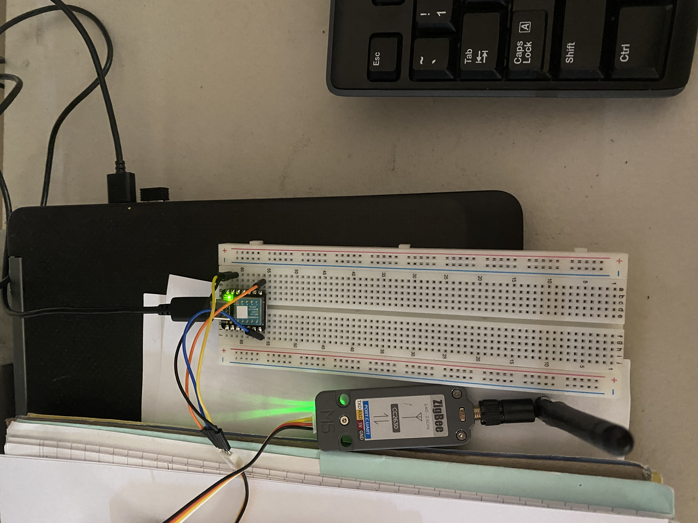

# Host PC
The code in this folder is intended to run on a host PC connected to
the Seeed Studio XIAO SAMD21.



# Description
* Reads incoming serial messages from SAMD21 containing data packets
from ZigBee module
* Forms a secure connection to SQL database to store data
* Trains a Linear Regression model to predict hook weight based on ADC strain
* Predicts hook weight
* Can be configured to collect training data for hook weight and store in a local csv file

# Build Instructions
1. Ensure python3 is installed on host pc
2. From the from home directory
```bash
cd 'Host PC'
python3 embedded.py
```
or alternatively to collect training data for weight
```bash
cd 'Host PC'
python3 embedded.py --training --mass -f [file-name].csv
```
